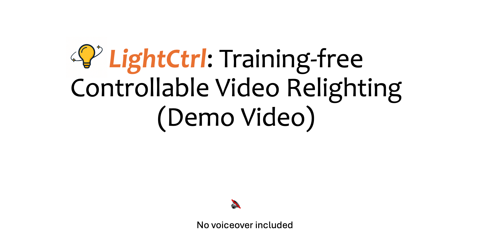
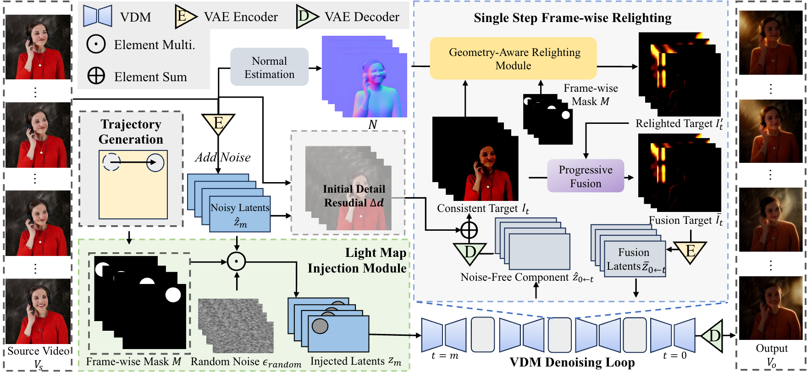

## LightCtrl: Training-free Controllable Video Relighting
<h5>Yizuo Peng<sup>1,2</sup>, <a href='https://xuelin-chen.github.io/'>Xuelin Chen</a><sup>3</sup>, Kai Zhang</a><sup>1,*</sup>, <a href='https://vinthony.github.io'>Xiaodong Cun</a><sup>2,*</sup>

<sup>1</sup> Tsinghua University &nbsp;&nbsp;&nbsp; <sup>2</sup><a href='https://gvclab.github.io'>GVC Lab, Great Bay University</a>  &nbsp;&nbsp;&nbsp; <sup>3</sup>Adobe Research &nbsp;

**[Arxiv]| [PDF]**

## Demo Video

[](https://youtu.be/CQfTe9jAGD8)


## Method Overview

<div align="center">
  
</div>

We perform controllable video relighting with a user-provided light trajectory. Where we inject the light map on the noisy latent of VDM using the light map injection module. Then, in each denosing step, we design a geometry-aware relighting module to produce the relighted results frame-wise. Thus, the VDM can help to generate consistent video results with controllable lighting.

## More Results
<table class="center">
    <tr style="font-weight: bolder;text-align:center;">
        <td>Input Video</td>
        <td>Light Map</td>
        <td>Relighted video</td>
    </tr>
  	<tr>
	  <td>
	    
	  </td>
	  <td>
	    
	  </td>
	  <td>
	    
	  </td>
  	</tr>
  	<tr>
	  <td>
	    
	  </td>
	  <td>
	    
	  </td>
	  <td>
     	    
	  </td>
  	</tr>
         <tr>
	  <td>
	    
	  </td>
	  <td>
	    
	  </td>
	  <td>
     	    
	  </td>
  	</tr>
	<tr>
	  <td>
	    
	  </td>
	  <td>
	    
	  </td>
	  <td>
     	    
	  </td>
  	</tr>
</table >


## Get Started
### 1. Setup the repository and environment
```
git clone https://github.com/GVCLab/LightCtrl.git
cd LightCtrl
conda create -n LightCtrl python==3.10
conda activate LightCtrl
pip install -r requirements.txt
```
### 2. Download the pretrained model
IC-Light:[🤗Huggingface](https://huggingface.co/lllyasviel/ic-light) ;

SD RealisticVision: [🤗Huggingface](https://huggingface.co/stablediffusionapi/realistic-vision-v51) ;

Animatediff Motion-Adapter-V-1.5.3: [🤗Huggingface](https://huggingface.co/guoyww/animatediff-motion-adapter-v1-5-3)

### 3. 💡Relighting

Video relighting with user-defined light setting
```python
python relight.py --config "configs/animatediff_relight/music_girl.yaml"
```

LightCtrl also supports CogVideoX backbone

```python
python cog_relight.py --config "configs/cog_relight/blackman.yaml"
```

## Citation

If you find our work helpful, please leave us a star and cite our paper.
```

```

## Acknowledgements

We are very grateful to the authors of [Light-A-Video](https://github.com/bcmi/Light-A-Video), [AnimateDiff](https://github.com/guoyww/AnimateDiff), [CogVideoX](https://github.com/THUDM/CogVideo), and [IC-Light](https://github.com/lllyasviel/IC-Light) for the foundation of our code from their open-source code.

